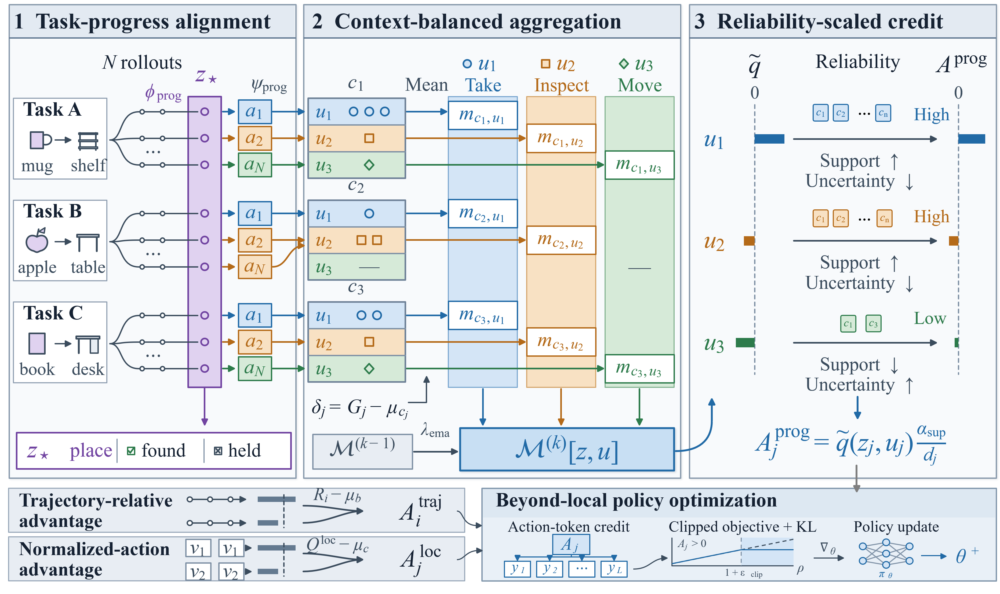

# BLPO: Beyond-Local Policy Optimization via Cross-Trajectory Credit Assignment for Long-Horizon LLM Agents



BLPO improves long-horizon agent training by assigning credit at two complementary levels. A **local branch** compares normalized actions taken in the same concrete state. A **task-progress branch** shares evidence across trajectories whose histories imply the same progress condition, while context residualization, balanced EMA memory, and uncertainty-aware shrinkage limit biased cross-task comparisons. The two step-level signals are fused with the trajectory-relative advantage and used directly by the policy update; no critic is trained.

## Results

Mean ± standard deviation over three random evaluation seeds, as reported in the paper:

| Backbone | ALFWorld Seen success ↑ | ALFWorld Unseen success ↑ | WebShop success ↑ | WebShop task score ↑ |
|---|---:|---:|---:|---:|
| Qwen2.5-1.5B-Instruct | **94.01 ± 0.24** | **91.54 ± 0.60** | **74.02 ± 1.39** | **87.43 ± 0.56** |
| Qwen2.5-7B-Instruct | **97.14 ± 1.33** | **92.97 ± 0.64** | **79.43 ± 1.57** | **88.90 ± 1.26** |

## Repository layout

```text
blpo/
  algorithm.py             BLPO credit estimator and context-balanced memory
  keys.py                  local and task-progress state construction
  actions.py               concrete and abstract action normalization
  returns.py               trajectory and decision return utilities
  environments/            ALFWorld and WebShop rule implementations
  integration/trainer.py   minimal trainer adapter and memory checkpointing
  prompts/                 prompts used in the reported experiments
configs/                    paper configurations for both environments
docs/                       integration, prompt, and provenance notes
tests/                      deterministic unit tests
```

## Installation

BLPO is an algorithm package layered on an existing on-policy agent-training runtime. It does not vendor the policy model, vLLM/Ray/FSDP runtime, or the ALFWorld/WebShop environments.

```bash
git clone https://github.com/Tdadada/BLPO.git
cd BLPO
pip install -e .
```

For audit logging to Parquet, install the optional dependency:

```bash
pip install -e ".[audit]"
```

## External environments and data

**Datasets, environment assets, model weights, checkpoints, and generated trajectories are not part of this repository and must not be committed.** Install them in external directories and point the host training runtime to those directories.

1. Install an agentic RL runtime. The reported experiments use the multi-turn rollout interface provided by [verl-agent](https://github.com/langfengQ/verl-agent). Follow its installation instructions for the CUDA, PyTorch, vLLM, Ray, and FSDP versions on your system, then install this package into the same Python environment.
2. For ALFWorld, follow the [official ALFWorld setup](https://github.com/alfworld/alfworld). A typical text-environment setup is:

   ```bash
   pip install alfworld
   export ALFWORLD_DATA=/absolute/path/to/alfworld-data
   alfworld-download -f
   ```

3. For WebShop, follow the [official WebShop setup](https://github.com/princeton-nlp/WebShop). Its setup script downloads product/instruction data and builds the search index:

   ```bash
   git clone https://github.com/princeton-nlp/WebShop.git /absolute/path/to/webshop
   cd /absolute/path/to/webshop
   ./setup.sh -d all
   export WEBSHOP_HOME=/absolute/path/to/webshop
   ```

4. Download the Qwen2.5-Instruct backbone separately through the model provider accepted by your runtime, and reference its absolute path in the runtime configuration. Model files are never copied into this repository.

The checked-in YAML files contain only BLPO and rollout hyperparameters; paths to the environment data, task manifests, and model are supplied by the host runtime. The required per-decision metadata is listed in [docs/integration.md](docs/integration.md).

## Training integration

Create one estimator per training run and keep it alive across policy updates:

```python
from blpo import BLPOConfig
from blpo.integration import BLPOEstimator

estimator = BLPOEstimator(BLPOConfig(
    webshop_abstraction="decision_frontier_v4",  # ignored by ALFWorld
    role_current_batch_center=is_webshop,
))

advantages, returns, metrics, examples = estimator.compute(
    batch=rollout_batch,
    token_level_rewards=token_level_rewards,
    response_mask=response_mask,
    update=global_step,
    gamma=0.95,
)
rollout_batch.batch["advantages"] = advantages
rollout_batch.batch["returns"] = returns
```

Save and restore the BLPO memory together with the actor checkpoint:

```python
estimator.save(checkpoint_dir)
estimator.load(checkpoint_dir)
```

The complete batch contract and integration points are documented in [docs/integration.md](docs/integration.md). Paper settings are in [configs/alfworld.yaml](configs/alfworld.yaml) and [configs/webshop.yaml](configs/webshop.yaml).

## Reproducibility

The implementation was extracted from the code snapshot used to produce the paper's audited ALFWorld and WebShop step records. See [docs/provenance.md](docs/provenance.md). Run the local checks with:

```bash
python -m pytest -q
```

## Status

This directory is the clean BLPO-only release candidate. It intentionally excludes baseline implementations, experimental variants, datasets, environment assets, model weights, checkpoints, optimizer states, cluster paths, and failed-run artifacts. A repository license should be selected before public release; third-party attribution is recorded in [THIRD_PARTY_NOTICES.md](THIRD_PARTY_NOTICES.md).
